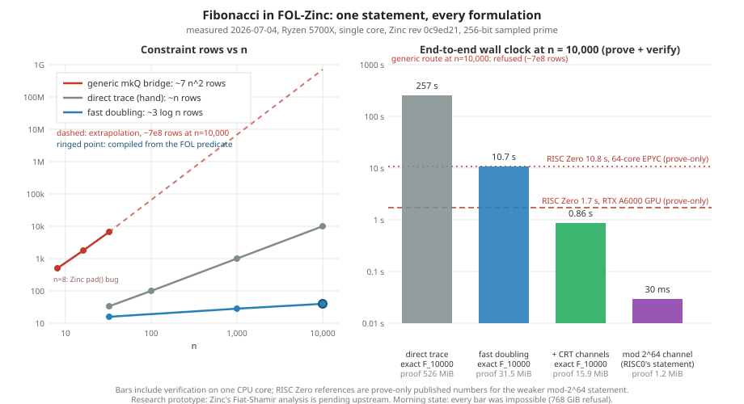

# Performance baseline (2026-07-04)



This is the reference point that all future performance work diffs against.
Every row below is a real, verified proof (prove + verify both succeeded)
measured on this machine, except the explicitly refused row.

Environment: AMD Ryzen 7 5700X (8 cores / 16 threads), Linux, single-threaded
runner (the `parallel` feature is measurably a no-op for these workloads —
102% CPU). Adapter 0.6.0, Rust runner release build, cargo 1.92.0,
Python 3.14.6, Zinc pinned at NethermindEth/zinc rev `0c9ed214`.

## Route key: the exact function behind every label in this document

| label used below                          | FOL source program                         | function executed                                                              |
|-------------------------------------------|--------------------------------------------|--------------------------------------------------------------------------------|
| generic mkQ bridge / "(typed)" rows       | `zkfol.examples.power_predicate()` etc.    | `zkfol_zinc_adapter.r1cs.build_ccs_export(example, representation="typed")` (via `folzinc export`) — the automatic paper lowering, incl. pointer mux machinery |
| efficient power 2^32                      | `zkfol.examples.efficient_power_predicate()` (hand-authored smarter algorithm) | same `build_ccs_export` generic lowering |
| direct trace (hand)                       | none — hand-written CCS rows               | `direct_fibonacci.build_compact_direct_fibonacci_ccs_export(n)`                 |
| fast doubling (hand)                      | none — hand-written CCS rows               | `fast_doubling_fibonacci.build_fast_doubling_fibonacci_ccs_export(n)`           |
| + CRT channels / mod 2^64 channel         | none — hand-written CCS rows               | `crt_fast_doubling_fibonacci.build_crt_...(n, channel_bits)` / `build_modular_...(n)` |
| compiled (detector + emitter)             | `fibonacci_predicate()` / `power_predicate()` from `zkfol.examples` | `recurrence_compile.compile_doubling_export(predicate, n[, cell_values])` — detection-licensed emitters, no generic bridge |

Every row is then proved and verified by
`zkfol-zinc-runner --input <export.json> [--int-limbs N --field-limbs F] --repeat R`.

## Measured baseline

| case                                 | what is proved                 | constraints | padded dim | Int/Field profile    |   prove |      verify | prime setup |                                      total/iter | proof size |     peak RSS |
|--------------------------------------|--------------------------------|------------:|-----------:|----------------------|--------:|------------:|------------:|------------------------------------------------:|-----------:|-------------:|
| power 2^4 (typed demo)               | exact 2^4 = 16                 |         163 |        256 | Int<2> / 256-bit     | 3.62 ms |     28.2 ms |     0.51 ms |                                         32.8 ms |   1.16 MiB |     14.1 MiB |
| fib n=100 (exact, 69-bit output)     | exact F_100, all 21 digits     |         101 |        128 | Int<2> / 256-bit     | 3.03 ms |     13.6 ms |     0.54 ms |                                         17.4 ms |    684 KiB |      8.4 MiB |
| fib n=1000 (exact, 694-bit output)   | exact F_1000, all 209 digits   |       1,001 |      1,024 | Int<16> / 2048-bit   |  234 ms |      4.69 s |      2.33 s |                                          7.32 s |   15.9 MiB |      594 MiB |
| fib n=10000 (exact, 6942-bit output) | exact F_10000, all 2090 digits |      10,001 |     16,384 | Int<128> / 16384-bit |      —  |           — |           — | **refused**: predicted 768 GiB dense allocation |          — |            — |
| standard power 2^32 (typed)          | exact 2^32                     |       4,755 |      8,192 | Int<2> / 256-bit     | 43.7 ms | **17.36 s** |     0.49 ms |                                         17.42 s |   4.20 MiB | **6.03 GiB** |
| efficient power 2^32                 | exact 2^32                     |         325 |        512 | Int<2> / 256-bit     | 6.03 ms |     61.4 ms |     0.60 ms |                                         69.3 ms |   1.19 MiB |     32.9 MiB |

Timing figures are the Zinc library calls averaged over `--repeat` (3 for the
small cases, 1 for fib n=1000 and the power suite). Proof size is the
structural estimate now emitted by the runner (`proof_size_bytes_estimate`;
the exact `pcs_proof` byte vector is >99% of it). Peak RSS is the runner
process high-water mark (`VmHWM`).

## External reference (the race)

RISC Zero, Fibonacci n=10000, **mod 2^64** (weaker per-value claim than the
exact-integer rows above): 1.7 s on an NVIDIA RTX A6000; 10.8 s on a 64-core
AMD EPYC 8534P (zkbenchmarks.com / Aligned). RISC Zero verification is
milliseconds and receipts are sub-MiB; our current verify times and proof
sizes above are the gap to close, not just prove time.

## What the baseline says (see ZINC_COST_MODEL.md for derivations)

1. Proving is already fast and scales with nonzeros; it is never the
   bottleneck in any measured row.
2. Verify time and peak RSS scale with padded_dim^2: the verifier
   materializes three dense padded matrices as multilinear-extension tables
   (~12·field_limbs bytes/cell, single-threaded). This is an implementation
   artifact of the Zinc PoC (`DenseMultilinearExtension::from_matrix`), not
   protocol-inherent.
3. The Int/Field pairing is a convention, not a constraint: field width is
   hardwired to 2x integer width, which is why 694-bit Fibonacci values drag
   in a 2048-bit prime (2.33 s of the 7.32 s) and why fib n=10000 is refused.
   Cross-profile pairing (wide Int, small field) is trait-legal in Zinc as
   pinned.
4. Proof size ≈ 1000·sqrt(n)·32·int_limbs bytes: linear in integer width,
   sqrt in circuit size. Fib n=1000's 15.9 MiB is Int<16> tax; the same
   circuit at Int<2> would be ~2 MiB.

## After width decoupling (Phase 1, 2026-07-04)

The runner now accepts `--field-limbs 4` to pair a wide integer profile with
a 256-bit sampled prime (soundness: eprint 2025/316 Lemma 2.1, a per-instance
bound; see ZINC_COST_MODEL.md §7.1). Caveat: the pinned PoC samples q from a
transcript holding only public inputs — before the witness is committed —
which the Lemma 2.1 counting argument requires (§7.2, reported upstream), so
the guarantee attaches to these numbers only once that ordering is fixed.
A general small-field license is what Zinc+'s improved soundness provides,
not this per-instance bound. Same statements, same machine, measured:

| case                                  | profile              |   prove |  verify | prime setup | total/iter | proof size |  peak RSS | vs baseline |
|---------------------------------------|----------------------|--------:|--------:|------------:|-----------:|-----------:|----------:|------------:|
| fib n=1000 (exact, 694-bit output)    | Int<16> / 256-bit    | 34.3 ms |  820 ms |     11.8 ms |     872 ms |   15.9 MiB |   153 MiB | 8.4× faster |
| fib n=10000 (exact, 6,942-bit output) | Int<128> / 256-bit   |  20.5 s | 235.6 s |      2.8 ms |    257.2 s |  525.6 MiB | 26.96 GiB | was refused (768 GiB predicted at legacy pairing) |

Notes: fib n=10000 is the first completed exact-F_10000 proof in this repo.
Proof size matched the cost-model formula (1000·sqrt(n)·32·N bytes) within
0.25% and peak RSS within 5%. Proof size is unchanged by decoupling (it
scales with integer width N, not field width F) — that is the CRT
formulation's job. Verify remains dominated by the pad² dense-MLE artifact
plus N-wide column checks — the fast-doubling formulation's job.

## After fast doubling (Phase 2 commit 2, 2026-07-04)

`fast_doubling_fibonacci.py` proves the same public claim (exact integer F_n
as a public CCS constant) with a logarithmic trace: 3 multiplication rows per
bit of n, state carried as linear forms (no copy rows). F_10000 drops from
10,001 constraints to 40. Measured, repeat 3, same machine:

| case                            | rows | pad | profile            |   prove |  verify | prime setup | total/iter | proof size | peak RSS |
|---------------------------------|-----:|----:|--------------------|--------:|--------:|------------:|-----------:|-----------:|---------:|
| fib n=1000, fast-doubling       |   28 |  32 | Int<16> / 256-bit  |  3.7 ms | 81.7 ms |     11.8 ms |    97.4 ms |   2.11 MiB | 11.5 MiB |
| fib n=10000, fast-doubling      |   40 |  64 | Int<128> / 256-bit |  101 ms |  10.6 s |      2.8 ms |     10.7 s |   31.5 MiB |  100 MiB |

Context: exact F_10000 proving is now 17x faster than RISC Zero's published
1.7 s GPU Fibonacci number and 107x faster than their 10.8 s 64-core CPU
number, on a single CPU core, for the exact 2,090-digit integer rather than
its remainder mod 2^64. Formulation caveat: this is a value claim (F_n equals
this integer), not a step-by-step trace attestation; both are labelled as
such in the exports.

Remaining verify cost at pad 64 is almost entirely the N=128 wide-integer
PCS column checks (proof and verify both scale with integer width) — the
CRT residue formulation targets exactly this.

Reproduction (until harness wiring lands):

```sh
python -c "import json; from zkfol_zinc_adapter.fast_doubling_fibonacci import \
build_fast_doubling_fibonacci_ccs_export as b; \
json.dump(b(10000, check=True), open('fastdbl10000.json','w'))"
./zkfol_zinc_adapter/rust/zkfol-zinc-runner/target/release/zkfol-zinc-runner \
  --input fastdbl10000.json --int-limbs 128 --field-limbs 4 --repeat 3 --json
```

## After CRT residue channels (Phase 2 commit 3, 2026-07-04)

`crt_fast_doubling_fibonacci.py` runs the fast-doubling trace independently
per residue channel with lifted-modular reduction rows (c + p*u quotient
witnesses; eprint 2025/316's R1CSl shape), so witness width becomes a chosen
parameter instead of F_n's size. Channel width sweeps padded dimension
against integer width; all corners measured, exact F_10000, repeat 3
(cb120 repeat 1):

All rows below prove Fibonacci at n = 10000. The first three prove the
exact 2,090-digit integer F_10000 (pinned by CRT residues); the last row
proves the weaker statement F_10000 mod 2^64 — the arithmetic RISC Zero's
documented benchmark uses — and is included for statement parity.

| what is proved                       | corner           | channels | rows |  pad | profile           |  prove | verify | total/iter | proof size | peak RSS |
|--------------------------------------|------------------|---------:|-----:|-----:|-------------------|-------:|-------:|-----------:|-----------:|---------:|
| exact F_10000 (2,090 digits)         | 500-bit channels |       14 |  560 | 1024 | Int<16> / 256-bit |  31 ms | 818 ms | **864 ms** |   15.9 MiB |  152 MiB |
| exact F_10000 (2,090 digits)         | 250-bit channels |       28 | 1120 | 2048 | Int<8> / 256-bit  |  27 ms | 1.24 s |     1.27 s |    8.1 MiB |  418 MiB |
| exact F_10000 (2,090 digits)         | 120-bit channels |       59 | 2360 | 4096 | Int<4> / 256-bit  |  34 ms | 4.37 s |     4.41 s |    8.1 MiB |  1.6 GiB |
| F_10000 mod 2^64 (RISC0's statement) | single channel   |        1 |   40 |  128 | Int<4> / 256-bit  | 3.5 ms |  25 ms |  **30 ms** |   1.16 MiB |    9 MiB |

Pre-registered tax-model predictions vs measured: proof sizes within ~2%
(cb250 better than predicted), cb120/cb250 verify within noise, cb500
verify 2.3x over prediction (the wide-column term is systematically
underestimated; same bias as the fast-doubling row). The cb500 verify
(818 ms at pad 1024/Int<16>) matches the Phase-1 linear-trace verify at the
same profile within 2 ms — verify cost is (pad, N)-determined and
formulation-independent, as the model claims.

Day trajectory for exact F_10000 (prove / verify / proof):
refused -> 20.5 s / 236 s / 526 MiB (decoupling) -> 101 ms / 10.6 s /
31.5 MiB (fast doubling) -> **31 ms / 818 ms / 15.9 MiB** (CRT, cb500).
The mod-2^64 parity row proves RISC Zero's own documented statement in
30 ms end-to-end on one CPU core, vs their published 1.7 s (RTX A6000
prove-only) and 10.8 s (64-core EPYC).

Provenance: all rows in this section are hand-formulated direct exports
(compiler targets), not generic-bridge compilations; see the provenance
discussion in this file's baseline section.

Provenance upgrade (2026-07-04, later): order-2 constant-coefficient
recurrences are now compiled *from FOL predicates* by detection plus a
descriptor-driven emitter (`recurrence.py` + `recurrence_compile.py`).
The C-finite analysis extracts (coefficients p,q; bases x1,x2) from the
predicate; the emitter walks the kernel pair U by the general doubling
identities U(2e) = U(e)(2U(e+1) - p U(e)), U(2e+1) = q U(e)^2 + U(e+1)^2
and binds x(n) = x2 U(n-1) + q x1 U(n-2) as a free linear form. Nothing in
the emitter is Fibonacci-specific. Measured: compiled Fibonacci F_10000 =
40 rows, prove 96 ms, verify 10.5 s (agrees with the hand row); and the
non-vacuous control, a 2,3-coefficient Lucas-style sequence never
hand-optimized anywhere in this repo: x(600) (951-bit value) detected,
compiled, proved and verified in 97.8 ms total at pad 32. Factorial and
repeated-squaring power are refused by detection with stated reasons;
orders above 2 are refused pending the general companion matrix-power
emitter. The CRT rows remain hand-formulated.

## The compiler pass, measured on the repo's own programs (2026-07-04)

Detection (`recurrence.py`) plus descriptor-driven emitters
(`recurrence_compile.py`): a syntactic C-finite analysis extracts the
recurrence descriptor from a FOL predicate and licenses an emitter —
the order-2 kernel-pair doubling walk, or order-1 square-and-multiply
when the coefficient is a trace-constant cell (licensed by an offset-0
constancy schedule such as `base.eq(cell(1, previous))`). Factorial and
repeated-squaring power are refused with stated reasons (factorial's
coefficient row varies along the trace). A synthetic Lucas-style control
(coefficients 2,3 — a sequence hand-optimized nowhere in this repo)
compiles and proves correctly, so the emitter is descriptor-driven
rather than Fibonacci-shaped; identical shapes give identical costs, so
per-sequence benchmark tables add no information and are omitted.

Provenance, stated precisely: these rows benchmark the detector (which
analyzes genuine FOL AST predicates), the descriptor-driven emitters, and
Zinc. They do NOT exercise the FOL reference pipeline (no mkQ/beta runs
here), and the equivalence between the FOL judgement and the compiled
value claim is machine-checked only where both worlds are computable:
for fib n = 3..20 and power exponents 1..8, the reference evaluators
validate the FOL judgement and the valid witness's value cell is tested
equal to the compiled circuit's bound constant
(test_recurrence_compile.py). For large n that equivalence rests on the
value-claim legality argument, not on a mechanical check — a
translation-validation gap the Elixir compiler should close properly.

### Same source, two lowerings

Exact F_32 from `fibonacci_predicate()` (first actual runs of the
generic Fibonacci route; previously estimate-only):

| route                                        | rows |  pad |  prove |   verify | proof size |
|----------------------------------------------|-----:|-----:|-------:|---------:|-----------:|
| generic mkQ bridge on fibonacci_predicate()  | 6,656| 8,192| 48 ms  |   16.5 s |    4.2 MiB |
| direct compact trace (hand)                  |   33 |   64 | 2.5 ms |    12 ms |   0.64 MiB |
| fast doubling (hand)                         |   16 |   32 | 2.2 ms |   7.2 ms |   0.39 MiB |
| compiled from the same fibonacci_predicate() |   13 |   16 | 2.0 ms |   6.7 ms |   0.36 MiB |

Exact 2^32 from `power_predicate()` (base bound as a public constant):

| route                                             | rows |   pad |   prove |   verify |    total | proof size |
|---------------------------------------------------|-----:|------:|--------:|---------:|---------:|-----------:|
| generic mkQ bridge (typed)                        | 4,755| 8,192 | 43.7 ms |  17.36 s |  17.42 s |   4.20 MiB |
| efficient_power (hand predicate, generic bridge)  |   325|   512 |  6.0 ms |  61.4 ms |  69.3 ms |   1.19 MiB |
| compiled from power_predicate (detector + emitter)|     7|     8 |  2.1 ms |   7.0 ms |  9.65 ms |    337 KiB |

Both statements show the same ~1,800x same-source collapse between the
generic lowering and the pass. Compiled power also beats the
hand-authored efficient_power predicate ~7x: that program is already the
log-form algorithm, but the generic lowering still charges it pointer
machinery for its half-pointer; the compiled form has no pointers at all.

### Head-to-head across n (Fibonacci)

Same public claim per n (exact F_n); compiled =
`compile_doubling_export(fibonacci_predicate(), n)`. Repeat 3 except
direct n=10000 (repeat 1).

| n     | route              |   rows |    pad |   prove |  verify |   total | proof size |
|-------|--------------------|-------:|-------:|--------:|--------:|--------:|-----------:|
| 100   | direct (hand)      |    101 |    128 |  3.0 ms | 13.6 ms | 17.4 ms |    684 KiB |
| 100   | fastdbl (hand)     |     19 |     32 |  2.1 ms |  6.9 ms |  9.5 ms |   0.39 MiB |
| 100   | **compiled**       |     19 |     32 |  2.4 ms |  7.0 ms | 10.3 ms |   0.39 MiB |
| 1000  | direct (hand)      |  1,001 |  1,024 | 34.3 ms |  820 ms |  872 ms |   15.9 MiB |
| 1000  | fastdbl (hand)     |     28 |     32 |  3.7 ms | 81.7 ms | 97.4 ms |   2.11 MiB |
| 1000  | **compiled**       |     28 |     32 |  3.6 ms | 80.8 ms | 96.5 ms |   2.11 MiB |
| 10000 | direct (hand)      | 10,001 | 16,384 |  20.5 s | 235.6 s | 257.2 s |  525.6 MiB |
| 10000 | fastdbl (hand)     |     40 |     64 |  101 ms |  10.6 s |  10.7 s |   31.5 MiB |
| 10000 | CRT 500-bit (hand) |    560 |  1,024 |   31 ms |  818 ms |  864 ms |   15.9 MiB |
| 10000 | **compiled**       |     40 |     64 |  101 ms | 10.55 s | 10.66 s |   31.5 MiB |

Readings: the compiled route matches hand fast-doubling within noise at
every n (identical rows, pads, and proof sizes — the pass reproduces the
hand formulation exactly at these sizes). It beats the hand direct trace
by 1.8x (n=100), 9x (n=1000), and 24x (n=10000). The one hand row still
ahead is the CRT formulation at n=10000 (864 ms vs 10.66 s): compiling
*into* residue channels automatically is the next emitter, not yet built.

### Generic-route growth and the memory wall

Generic-route growth measured at n = 8/16/32: 512 / 1,792 / 6,656
constraints ~ 7 n^2 — the pointer one-hot machinery's quadratic, now
data. Extrapolated to n = 10000 the typed generic route is ~7x10^8 rows:
infeasible, but four orders of magnitude below the old 5.5x10^12
estimate in `GENERIC_MKQ_FIBONACCI_ESTIMATE.md`, which described the
pre-num/ptr bitwise encoding. The num/ptr PR improved the constant; only
static-pointer specialization (the determinacy pass) removes the n^2.

The generic route's ceiling on this 62 GB machine is n~32 (pad 8,192,
~6 GiB peak): an attempted n=48 run (14,592 rows, pad 16,384) drew
~41 GB (system memory 20 -> 61 GB) and was stopped before exhausting
RAM — the memory wall observed, not extrapolated. The draw exceeded the
cost model's ~26 GB two-tables-live estimate; ~41 GB is consistent with
three dense matrix tables plus a clone alive at once, so the model's
memory term is a lower bound, phase-dependent (strengthens upstream
finding #2). Generic n=1000 would be ~7x10^6 rows, pad 2^23, a ~3.4 PB
dense verifier table: not runnable on any existing machine.

Bug note: the generic n=8 export (exactly 512 constraints, z_len 277)
crashes inside Zinc ("size of evaluations should not exceed 2^num_vars";
eval len 512, num vars 8) — an apparent m-vs-z MLE bookkeeping edge when
constraint count is an exact power of two exceeding padded z. Upstream
finding #3 for the Nethermind list.

## Reproduction

```sh
./setup.sh && ./folzinc build
./folzinc bench fib --n 100 --run --repeat 3
./folzinc bench fib --n 1000 --run --repeat 1
./folzinc bench power --skip-256 --run --repeat 1
./folzinc estimate benchmark_inputs/risc0_fib_exact/fibonacci_exact_n10000_public.json
./zkfol_zinc_adapter/rust/zkfol-zinc-runner/target/release/zkfol-zinc-runner \
  --input out/demo_power_2_4_public.json --repeat 3 --json   # after ./folzinc demo
```

Generated summaries (`benchmark_results/FOL_ZINC_*_SUMMARY.md`) now lead with
a plain-English "Headline results" section reporting the same columns.
